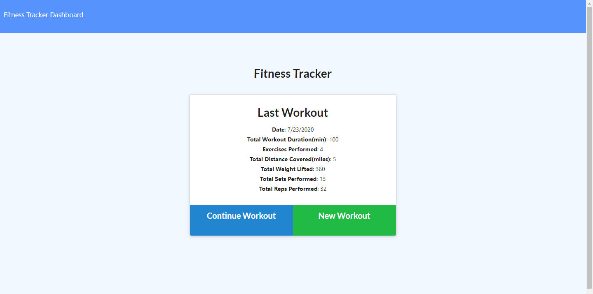
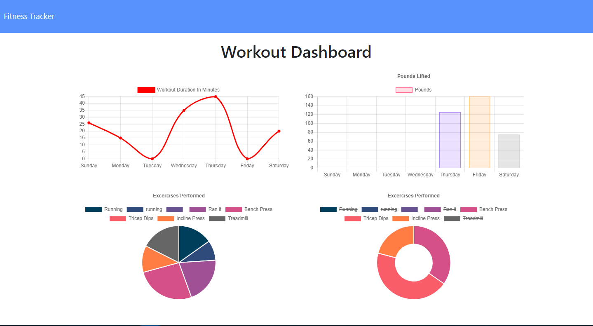
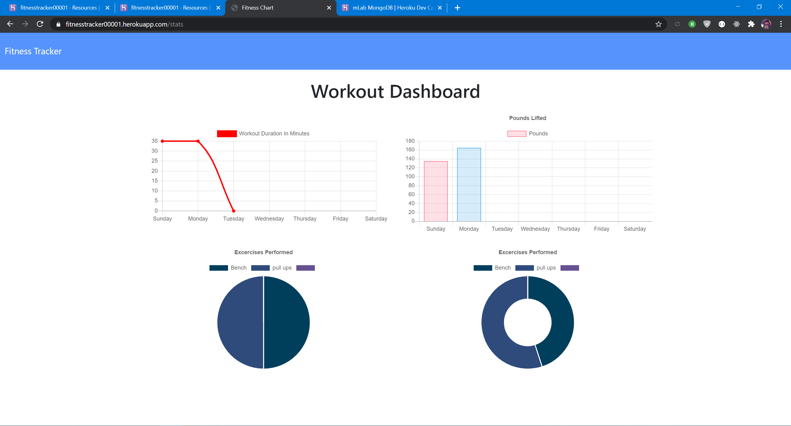

 # **Fitness Tracker App 🏋🏾‍♀️** 
  by David Yennerell a.k.a granderojo17 on 08/03/2020

 Full APP:  https://fitnesstracker00001.herokuapp.com/
  
   
  ## **Description🥇** 
   
  Monitor you workouts much faster with this fitness app. Included is a "Workout Dashboard" that will help you visualize your workout routine.
<div>





</div>


  ## ***Table of Contents🏀***

  * [Installation](#installation)
  * [Usage](#usage)
  * [Contributing](#contributing)
  * [Questions](#questions)
  
  ## Installation⛹️‍♀️
   follow the link or otherwise haave a local database nearby.
  ### To install necessary dependencies, run the following command:
   https://fitnesstracker00001.herokuapp.com/ and click "Continue Workout" and then fill in your workout
  # **Usage🏌️**
  In just a few easy steps you can track and monitor your workout schedule.
  # **License🌌**
  mit
  ### This project is licensed under the mit license.

 
  ```
Either have mongodb or mysql and plug in accordingly. 
Most all of it is there for you after a nice npm install..🤑
```
  
 
  
  # **Created by 🔮** 
   
 
  
   
**Contact📞**
  <!--  -->
  [GrandeRojo17](mailto:david.yennerell@gmail.com "personal Email") directly. Send any ideas my way.
  granderojo17

  